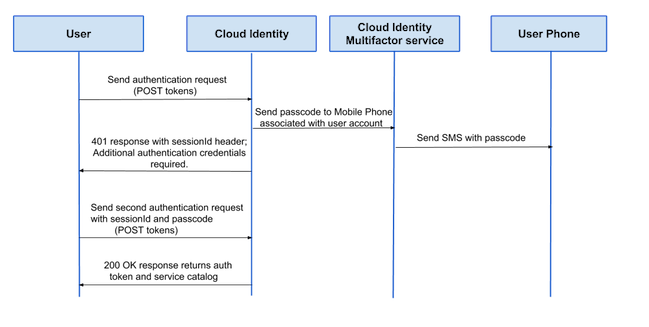

.. _multifactor-authenication-ovw:

=====================================
Configure multi-factor authentication
=====================================

.. contents::
   :local:
   :depth: 1

To improve security, customers can configure Rackspace Cloud accounts to
support multi-factor authentication which requires users to authenticate
in two steps:

#. Submit an initial **POST tokens** request to the Identity service
   endpoint, with username and password credentials.

   The response body returned by the Identity service includes a session
   ID header and a request for additional credentials.

#. Submit a second **POST tokens** request that includes the session ID
   header and a passcode retrieved from a device associated with the
   user's account.

   If the credentials are valid, the Identity service returns an
   authentication token and service catalog that includes the API
   service endpoints available to the user.

The following figure shows the multi-factor authentication process work flow.

**Figure: Multi-factor authentication process flow**

To enable multi-factor authentication, users must update the account
settings to add and verify a device that can be used to supply the
multi-factor authentication passcode.
You can configure account settings
from the Cloud Control panel
, or by using the Identity service API.

The following figure shows the work flow to set up multi-factor authentication
on an account.

**Figure: Multi-factor authentication user account set up work
flow**

.. figure:: ../_images/multifactor_setup_user1.png
   :alt: Multi-factor authentication user account set up work flow

Additionally, Identity and user administrators can define multi-factor
authentication policy for a domain by configuring the domain
enforcement setting. For example, if the domain enforcement setting is
*Required*, users who have not set up multi-factor authentication are
required to enable it before they can access their account.

.. include:: mfa-content/proc-mfa-setup-phone.rst

.. include:: mfa-content/proc-mfa-setup-otp.rst

.. include:: mfa-content/proc-mfa-auth.rst

.. include:: mfa-content/proc-mfa-enforce.rst

.. include:: mfa-content/proc-mfa-manage.rst
